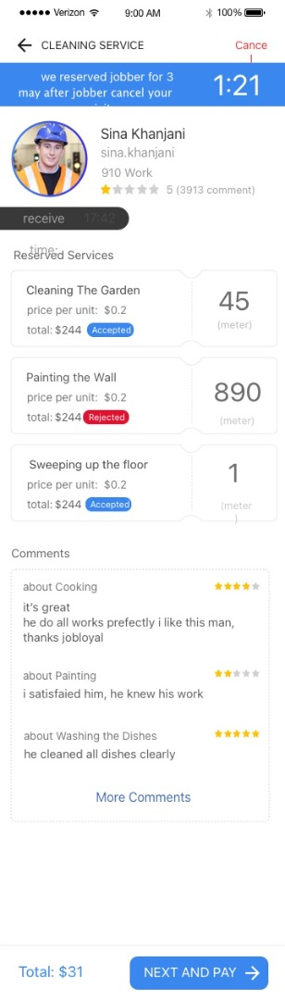
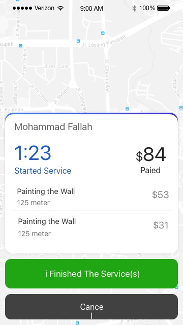
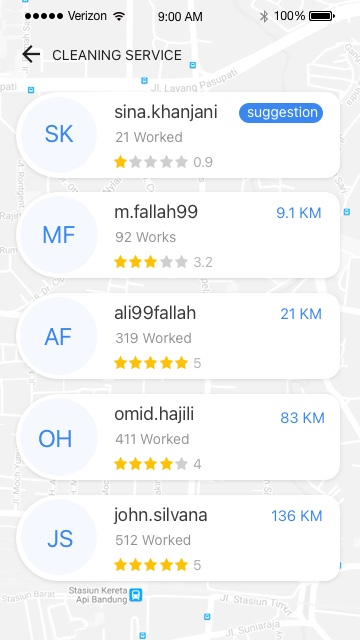
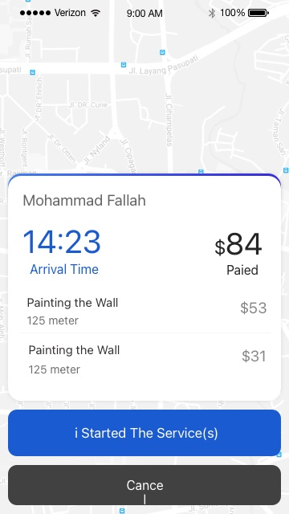
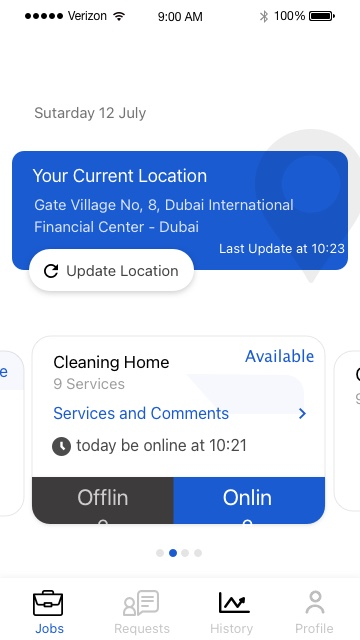
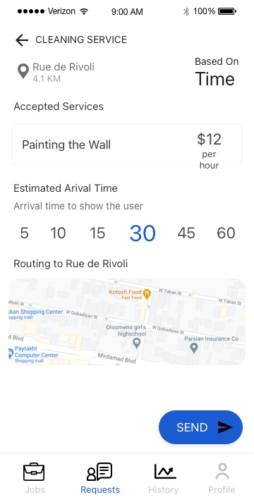

# 🚀 Dubbel - All Home Services

## 🌍 Overview
Dubbel is a real-time home services marketplace application, available for both iOS and Android as native applications. The platform connects users (customers) with service providers (jobbers), enabling seamless service booking and management. The backend is powered by Node.js with a PostgreSQL database, ensuring high scalability and efficiency.

## 🛠️ Technologies Used
- **📱 Frontend:** Native iOS (Swift) & Native Android (Kotlin)
- **🖥️ Backend:** Node.js (Express.js)
- **🗄️ Database:** PostgreSQL
- **⚡ Real-time Features:** Firebase Silent Push Notifications
- **🔐 Authentication:** OTP-based login system
- **💳 Payments:** Integrated with Stripe

## 🔥 Features
### 👤 User (Customer) App
- **📝 User Registration & Login:** OTP-based authentication
- **🔍 Service Search & Booking:** Browse, search, and filter services based on location and availability
- **📲 Real-time Notifications:** Receive updates about service requests, provider responses, and job status
- **⏳ Order Tracking:** Track job progress and estimated time for service completion
- **⭐ Ratings & Reviews:** Provide feedback for service providers
- **💰 Secure Payments:** Pay securely via Stripe integration
- **⚙️ Profile Management:** Update personal details, saved addresses, and view order history

### 🛠️ Jobber (Service Provider) App
- **✅ Provider Registration & Verification:** Onboarding with profile verification
- **📋 Job Listings & Management:** Accept or decline job requests in real time
- **💵 Earnings Dashboard:** View job history and revenue insights
- **🗺️ Geolocation & Route Optimization:** Get optimized routes for job locations
- **💬 Customer Communication:** In-app chat and call feature (if enabled)
- **📊 Ratings & Performance Tracking:** Track feedback and performance metrics

### 🖥️ Admin Dashboard
- **👥 User & Provider Management:** Oversee customer and service provider activities
- **📂 Service Category Management:** Add, update, or remove services
- **💳 Transaction & Payment Monitoring:** Track payments and commissions
- **📈 Analytics & Reports:** Monitor platform growth and user engagement

## 📸 Screenshots

## 📜 License
This project is for demonstration purposes only and is not intended for production use.

---
*Developed by Sina Khanjani✨*
